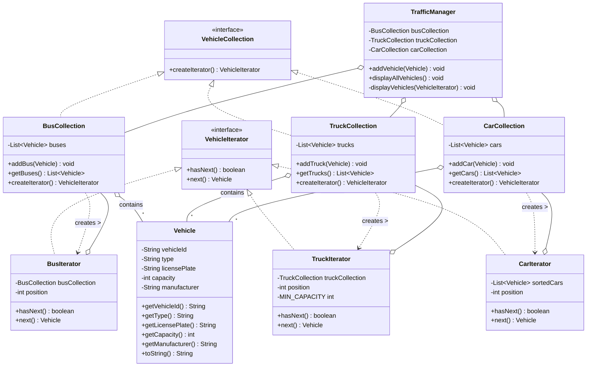

# Traffic Management System - Iterator Pattern Implementation

This project demonstrates the implementation of the Iterator design pattern for a traffic management system. The system manages different types of vehicles (buses, trucks, and cars) using specialized collections and iterators.

## Project Structure

- `Vehicle.java` - Base class for all vehicles with properties like ID, type, license plate, capacity, and manufacturer
- `VehicleIterator.java` - Interface defining the Iterator pattern with `hasNext()` and `next()` methods
- `VehicleCollection.java` - Interface for collections with the `createIterator()` method
- `BusCollection.java` & `BusIterator.java` - Collection and iterator for buses
- `TruckCollection.java` & `TruckIterator.java` - Collection and iterator for trucks (filters trucks with capacity < 10)
- `CarCollection.java` & `CarIterator.java` - Collection and iterator for cars (sorts cars by ID)
- `TrafficManager.java` - Client class that manages all vehicle collections
- `Main.java` - Demo application showing the pattern in action

## Special Features

1. **BusIterator**: Iterates through all buses in the collection
2. **TruckIterator**: Only iterates through trucks with capacity >= 10 tons
3. **CarIterator**: Iterates through cars sorted by their ID

## How to Compile and Run

```bash
# Compile all Java files
javac *.java

# Run the main class
java Main
```

## Expected Output

The program will display:
1. All buses in the system
2. All trucks with capacity >= 10 tons
3. All cars sorted by ID
4. Individual demonstrations of each iterator type

## Iterator Pattern Implementation

This project follows the Iterator pattern with:
- **Concrete Collections**: BusCollection, TruckCollection, CarCollection
- **Concrete Iterators**: BusIterator, TruckIterator, CarIterator
- **Client**: TrafficManager that uses the iterators without knowing the underlying collection structure

## Class Diagram


