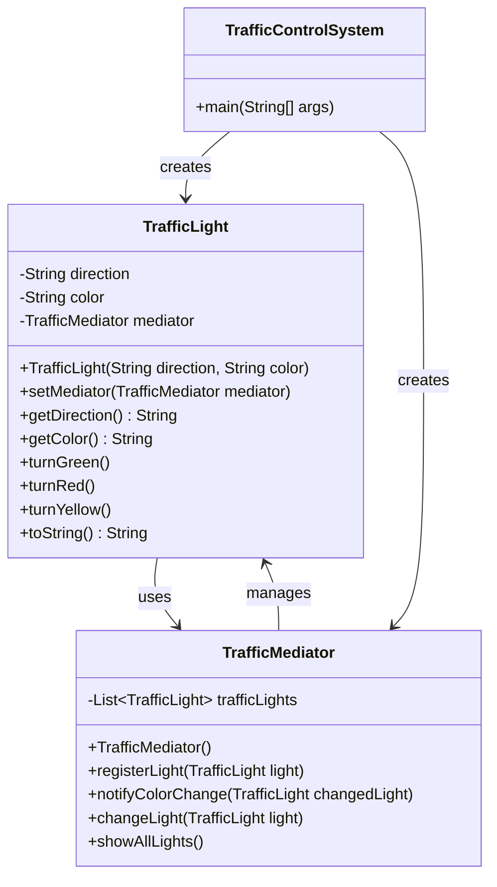

# Class Diagram for Traffic Control System using Mediator Pattern

## Explanation of the Mediator Pattern Implementation

### Components

1. **TrafficLight (Colleague)**
   - Represents a traffic light at a specific direction (East, West, North, South)
   - Has properties for direction and color (green, red, yellow)
   - Contains a reference to the mediator
   - Notifies the mediator when its state changes

2. **TrafficMediator (Mediator)**
   - Coordinates all traffic lights
   - Maintains a list of all traffic lights in the system
   - Implements the logic to ensure traffic safety (when one light turns green, others turn red)
   - Provides methods to register lights and handle state changes

3. **TrafficControlSystem (Client)**
   - Creates and configures the objects
   - Demonstrates how the system works

### Relationships

- **TrafficLight → TrafficMediator**: Each traffic light has a reference to the mediator to notify it of state changes
- **TrafficMediator → TrafficLight**: The mediator maintains a collection of traffic lights it coordinates
- **TrafficControlSystem → TrafficLight, TrafficMediator**: The client creates and configures both components

### Benefits of the Mediator Pattern in this System

1. **Decoupling**: Traffic lights don't need to know about each other, reducing dependencies
2. **Centralized Control**: All coordination logic is in one place (the mediator)
3. **Simplified Maintenance**: Changes to coordination rules only affect the mediator
4. **Extensibility**: New traffic lights can be easily added to the system
